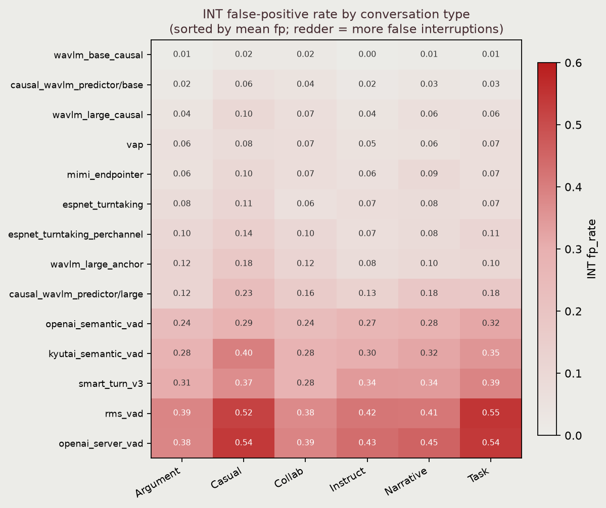
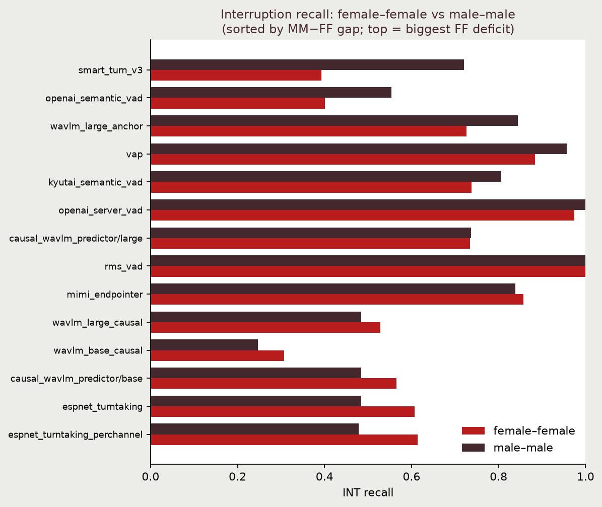

# Baseline scores by conversation metadata — findings

Per-conversation scores for the committed baselines, pooled by `conversation_type`
and speaker-gender pairing. Numbers below are the **test set (116 conversations,
golden gold)**; reproduce with:

```bash
HF_TOKEN=<gold-token> uv run --extra eval python data_analysis/results_by_conversation_type.py \
    --dataset mundo-ai/turn-benchmark-test-golden
```

(Dev, `uv run --extra eval python data_analysis/results_by_conversation_type.py`, runs token-free
but is thin at 38 conversations.) Cells are `recall / fp_rate / median-latency-ms`,
pooling TP/FN/FP/TN within each group. See `per_conversation.py` for the complementary
*dataset*-characterization stats.

## 1. Gold structure (baseline-independent)

| conversation_type | n | EOT+ | EOT- | INT+ | INT- | INT+/conv |
| --- | --: | --: | --: | --: | --: | --: |
| Argumentative/Deliberative | 24 | 1234 | 548 | 268 | 2054 | **11.2** |
| Casual/Spontaneous | 22 | 1303 | 627 | 142 | 2985 | 6.5 |
| Collaborative/Problem-Solving | 20 | 1353 | 560 | 142 | 2620 | 7.1 |
| Instructional | 19 | 877 | 480 | 95 | 2214 | 5.0 |
| Narrative/Storytelling | 15 | 735 | 422 | 74 | 1981 | 4.9 |
| Task-Oriented/Transactional | 16 | 791 | 554 | 83 | 1924 | 5.2 |

- **Argumentative/Deliberative is the interruption hotspot — ~11 real interruptions/conv,
  ~2× every other type.** The benchmark's floor-taking signal is concentrated in arguments.
- Casual/Spontaneous & Collaborative are the most turn-dense (most EOT+) and backchannel-dense
  (most INT-negatives, ~130+/conv) — rapid, overlappy talk.
- Narrative/Storytelling & Instructional are the most monologic (fewest events/conv).

## 2. EOT is strikingly type-robust
Every model's EOT **recall is flat across all six types** (e.g. `openai_server_vad`
0.94–0.96 everywhere; `wavlm_large_anchor` 0.76–0.81). Conversation type mainly moves the
**false-positive rate of acoustic detectors** — `rms_vad` false-fires EOT most on pause-heavy
Narrative (0.70) and Casual (0.70), least on Instructional (0.51). Expected (more mid-turn
pauses → more false turn-ends), now quantified.

## 3. INT false positives concentrate in casual chit-chat, not arguments
Across nearly every model, INT false-positive rate **peaks on Casual/Spontaneous and
Task-Oriented** and is *lowest* on Argumentative/Collaborative:

| model | Casual fp | Task fp | Argumentative fp |
| --- | --: | --: | --: |
| openai_server_vad | **0.54** | **0.54** | 0.38 |
| rms_vad | **0.52** | **0.55** | 0.39 |
| espnet_turntaking_perchannel | **0.32** | 0.31 | 0.24 |

The conversations that trip up interruption detection are **backchannel-heavy casual talk**
(all those "uh-huh"s misfiring as floor-taking) — *not* the argument-heavy ones, despite
arguments carrying 2× the real interruptions. Mildly counterintuitive; worth highlighting.



Reading down the heatmap the whole column pattern is consistent: for **every** model the
Casual and Task-Oriented columns are the reddest and Argumentative/Collaborative the palest.
The peak is where the small talk is, the trough is where the real interruptions are.
Regenerate with `plot_by_metadata.py` (see §6).

## 4. Candidate gender effect on interruption detection (needs confirmation)
Several **independent** models detect interruptions worse on **female–female** pairs — lower
recall and/or higher fp — with **no comparable gap on EOT**:

| model (INT) | FF | MM |
| --- | --- | --- |
| wavlm_large_anchor | 0.73 rec / 0.17 fp | 0.84 / 0.09 |
| openai_semantic_vad | 0.40 rec / 0.27 fp | 0.55 / 0.27 |
| espnet_turntaking_perchannel | 0.81 / 0.30 fp | 0.75 / 0.21 |
| causal_wavlm_predictor/large | 0.73 / 0.21 fp | 0.74 / 0.14 |



Sorted by the MM−FF gap: the top rows (`smart_turn_v3`, `openai_semantic_vad`,
`wavlm_large_anchor`) are the models with the largest female-female recall deficit. Note the
effect is *not* universal — the two `espnet` variants actually invert it (higher FF recall,
but at higher FF fp), which is why the caveat below matters.

That the gap appears across acoustic, semantic, and learned models — and only on INT — makes it
more than noise. **Caveats before claiming it:** small samples (FF=37, MM=26, mixed=53), and
gender pairing may correlate with conversation type. Needs a controlled check (hold type fixed)
before it goes in the paper.

## 5. Model-family regimes hold within every type
Acoustic (high-recall / high-fp), semantic (low / low), anchor (balanced but ~1100 ms INT
latency) — the ordering is unchanged inside all six types. The breakdown enriches the story
without overturning the headline.

## 6. Full results (test set, 116 conversations, 14 baselines)

All numbers below are the raw `results_by_conversation_type.py` output on
`mundo-ai/turn-benchmark-test-golden`. By-type cells are `recall / fp_rate` (latency
dropped — it is ~model-constant across types); by-pairing cells are
`recall / fp_rate / median-latency-ms`. **fp over the 0.10 budget is in bold.**

The two figures above (§3, §4) regenerate from the same scoring pass with:

```bash
HF_TOKEN=<gold-token> uv run --extra eval --extra plot python data_analysis/plot_by_metadata.py \
    --dataset mundo-ai/turn-benchmark-test-golden
```

### EOT by conversation type — `recall / fp`

| baseline | Argument | Casual | Collab | Instruct | Narrative | Task-Or |
| --- | --- | --- | --- | --- | --- | --- |
| causal_wavlm_predictor/base | 0.17/0.07 | 0.23/**0.12** | 0.18/**0.11** | 0.18/**0.12** | 0.18/**0.17** | 0.22/**0.16** |
| causal_wavlm_predictor/large | 0.29/0.07 | 0.39/0.10 | 0.35/**0.14** | 0.29/0.10 | 0.31/0.10 | 0.32/0.09 |
| espnet_turntaking | 0.40/0.10 | 0.42/**0.15** | 0.40/**0.13** | 0.42/**0.12** | 0.36/**0.11** | 0.40/0.10 |
| espnet_turntaking_perchannel | 0.63/0.05 | 0.65/0.06 | 0.59/0.06 | 0.59/0.06 | 0.60/0.07 | 0.64/0.06 |
| kyutai_semantic_vad | 0.78/0.06 | 0.72/0.03 | 0.77/0.06 | 0.80/0.05 | 0.74/0.04 | 0.77/0.03 |
| mimi_endpointer | 0.78/0.06 | 0.76/0.09 | 0.80/0.09 | 0.81/0.06 | 0.77/**0.12** | 0.78/0.07 |
| openai_semantic_vad | 0.27/0.02 | 0.29/0.01 | 0.35/0.02 | 0.30/0.03 | 0.32/0.03 | 0.27/0.00 |
| openai_server_vad | 0.96/**0.47** | 0.94/**0.50** | 0.95/**0.60** | 0.96/**0.50** | 0.96/**0.57** | 0.95/**0.51** |
| rms_vad | 0.71/**0.64** | 0.78/**0.70** | 0.66/**0.58** | 0.64/**0.51** | 0.75/**0.70** | 0.79/**0.66** |
| smart_turn_v3 | 0.66/0.04 | 0.60/0.02 | 0.64/0.03 | 0.70/0.04 | 0.63/0.06 | 0.65/0.03 |
| vap | 0.89/0.06 | 0.82/**0.11** | 0.84/0.08 | 0.87/0.04 | 0.82/0.09 | 0.85/0.08 |
| wavlm_base_causal | 0.25/0.04 | 0.26/0.02 | 0.31/0.06 | 0.33/0.03 | 0.29/0.04 | 0.29/0.03 |
| wavlm_large_anchor | 0.79/0.05 | 0.76/0.03 | 0.78/0.03 | 0.81/0.05 | 0.79/0.04 | 0.80/0.03 |
| wavlm_large_causal | 0.32/0.06 | 0.31/0.04 | 0.36/0.05 | 0.40/0.04 | 0.36/0.03 | 0.34/0.04 |

### INT by conversation type — `recall / fp`

| baseline | Argument | Casual | Collab | Instruct | Narrative | Task-Or |
| --- | --- | --- | --- | --- | --- | --- |
| causal_wavlm_predictor/base | 0.50/0.02 | 0.49/0.06 | 0.60/0.04 | 0.52/0.02 | 0.43/0.03 | 0.54/0.03 |
| causal_wavlm_predictor/large | 0.73/**0.12** | 0.74/**0.23** | 0.75/**0.16** | 0.79/**0.13** | 0.68/**0.18** | 0.83/**0.18** |
| espnet_turntaking | 0.60/0.08 | 0.56/**0.11** | 0.50/0.06 | 0.58/0.07 | 0.69/0.08 | 0.53/0.07 |
| espnet_turntaking_perchannel | 0.50/0.10 | 0.63/**0.14** | 0.52/0.10 | 0.38/0.07 | 0.54/0.08 | 0.54/**0.11** |
| kyutai_semantic_vad | 0.76/**0.28** | 0.78/**0.40** | 0.80/**0.28** | 0.92/**0.30** | 0.78/**0.32** | 0.78/**0.35** |
| mimi_endpointer | 0.82/0.06 | 0.89/0.10 | 0.87/0.07 | 0.87/0.06 | 0.73/0.09 | 0.80/0.07 |
| openai_semantic_vad | 0.50/**0.24** | 0.37/**0.29** | 0.46/**0.24** | 0.61/**0.27** | 0.53/**0.28** | 0.48/**0.32** |
| openai_server_vad | 0.99/**0.38** | 0.98/**0.54** | 0.99/**0.39** | 0.99/**0.43** | 1.00/**0.45** | 1.00/**0.54** |
| rms_vad | 1.00/**0.39** | 1.00/**0.52** | 1.00/**0.38** | 0.99/**0.42** | 0.97/**0.41** | 1.00/**0.55** |
| smart_turn_v3 | 0.58/**0.31** | 0.46/**0.37** | 0.54/**0.28** | 0.59/**0.34** | 0.65/**0.34** | 0.63/**0.39** |
| vap | 0.91/0.06 | 0.91/0.08 | 0.93/0.07 | 0.93/0.05 | 0.91/0.06 | 0.98/0.07 |
| wavlm_base_causal | 0.25/0.01 | 0.27/0.02 | 0.32/0.02 | 0.24/0.00 | 0.20/0.01 | 0.30/0.01 |
| wavlm_large_anchor | 0.77/**0.12** | 0.80/**0.18** | 0.77/**0.12** | 0.84/0.08 | 0.81/0.10 | 0.77/0.10 |
| wavlm_large_causal | 0.51/0.04 | 0.48/0.10 | 0.55/0.07 | 0.60/0.04 | 0.51/0.06 | 0.64/0.06 |

### EOT by speaker-gender pairing — `recall / fp / lat_ms`  (FF=37, MM=26, mixed=53)

| baseline | FF | MM | mixed |
| --- | --- | --- | --- |
| causal_wavlm_predictor/base | 0.21/**0.12**/364 | 0.19/**0.13**/344 | 0.18/**0.12**/301 |
| causal_wavlm_predictor/large | 0.42/**0.14**/529 | 0.25/0.07/762 | 0.29/0.08/654 |
| espnet_turntaking | 0.43/**0.14**/31 | 0.37/**0.11**/6 | 0.39/**0.11**/13 |
| espnet_turntaking_perchannel | 0.60/0.06/795 | 0.60/0.06/912 | 0.64/0.05/854 |
| kyutai_semantic_vad | 0.75/0.04/1184 | 0.75/0.04/1296 | 0.78/0.04/1161 |
| mimi_endpointer | 0.78/0.09/548 | 0.80/**0.11**/580 | 0.78/0.06/590 |
| openai_semantic_vad | 0.32/0.02/758 | 0.31/0.01/857 | 0.28/0.02/773 |
| openai_server_vad | 0.96/**0.53**/279 | 0.94/**0.56**/293 | 0.96/**0.51**/279 |
| rms_vad | 0.70/**0.60**/-99 | 0.73/**0.63**/-121 | 0.73/**0.66**/-126 |
| smart_turn_v3 | 0.60/0.03/1027 | 0.69/0.03/1030 | 0.65/0.04/1026 |
| vap | 0.84/0.09/300 | 0.85/0.09/362 | 0.86/0.06/296 |
| wavlm_base_causal | 0.28/0.05/608 | 0.28/0.03/608 | 0.30/0.03/678 |
| wavlm_large_anchor | 0.76/0.04/1191 | 0.79/0.04/1254 | 0.80/0.04/1158 |
| wavlm_large_causal | 0.35/0.05/657 | 0.33/0.04/687 | 0.34/0.04/597 |

### INT by speaker-gender pairing — `recall / fp / lat_ms`  (FF=37, MM=26, mixed=53)

| baseline | FF | MM | mixed |
| --- | --- | --- | --- |
| causal_wavlm_predictor/base | 0.57/0.05/938 | 0.48/0.02/811 | 0.50/0.03/1071 |
| causal_wavlm_predictor/large | 0.73/**0.21**/776 | 0.74/**0.14**/730 | 0.76/**0.15**/591 |
| espnet_turntaking | 0.61/0.09/197 | 0.48/0.07/238 | 0.60/0.08/212 |
| espnet_turntaking_perchannel | 0.61/**0.13**/848 | 0.48/0.07/1046 | 0.48/0.10/1145 |
| kyutai_semantic_vad | 0.74/**0.35**/383 | 0.81/**0.32**/392 | 0.83/**0.31**/371 |
| mimi_endpointer | 0.86/0.09/1050 | 0.84/0.07/1609 | 0.82/0.07/937 |
| openai_semantic_vad | 0.40/**0.27**/182 | 0.55/**0.27**/224 | 0.51/**0.28**/190 |
| openai_server_vad | 0.97/**0.50**/181 | 1.00/**0.44**/193 | 1.00/**0.43**/181 |
| rms_vad | 1.00/**0.48**/120 | 1.00/**0.44**/145 | 0.99/**0.42**/116 |
| smart_turn_v3 | 0.39/**0.34**/138 | 0.72/**0.35**/156 | 0.61/**0.33**/150 |
| vap | 0.88/0.07/1161 | 0.96/0.05/1079 | 0.93/0.07/1127 |
| wavlm_base_causal | 0.31/0.02/1176 | 0.25/0.00/951 | 0.25/0.01/1350 |
| wavlm_large_anchor | 0.73/**0.17**/1142 | 0.84/0.09/1152 | 0.80/0.10/1030 |
| wavlm_large_causal | 0.53/0.09/1252 | 0.48/0.05/1448 | 0.57/0.05/1168 |

(rms_vad's negative EOT latencies are an artifact of it firing before the gold turn-end —
its acoustic trigger leads the annotated boundary.)
